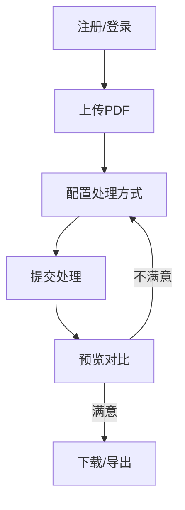

# 法律文档脱敏系统（FADE）产品需求文档（PRD）

---

## 1. 文档信息
- **文档版本**：v1.1
- **作者**：陈畅 张善 吴思远
- **日期**：2025-07-22
- **相关评审人**：请补充

---

## 2. 背景与目标
### 背景描述
随着法律、金融、医疗等行业对数据隐私和合规要求的提升，法律文档中涉及大量敏感信息（如姓名、地址、身份证号、邮箱等），人工脱敏效率低、易出错，亟需智能化、自动化的文档脱敏工具。

### 项目目标
- 实现一套支持多种敏感信息自动识别与多样化处理方式（马赛克、模糊、遮挡、彩色遮盖等）的文档脱敏系统。
- 支持用户自定义处理配置，支持CPU/GPU、NER/LLM等多种处理模式。
- 提供高效的前后端交互体验，支持文档上传、处理、预览、批量导出等全流程。

### 项目范围
- **本期范围**：PDF文档上传、敏感信息自动识别与脱敏、处理配置、预览对比、下载、批量导出、仪表盘统计、权限管理。
- **非目标范围**：非PDF文件处理、移动端App、多人协作、复杂审批流。

---

## 3. 核心需求与功能
### 需求概述
| 功能名称         | 简要描述                           |
|----------------|----------------------------------|
| 用户注册/登录    | 支持Token认证的用户体系           |
| 文档上传         | 支持PDF文件上传、去重              |
| 敏感信息识别     | 支持NER/LLM/正则多模型识别         |
| 脱敏处理         | 支持多种处理方式和自定义配置        |
| 处理日志         | 记录每次处理的详细日志              |
| 预览与对比       | 原文/处理后文档并排预览、敏感信息定位|
| 配置调整         | 支持实时调整配置并重新处理          |
| 下载与导出       | 单文件/批量下载、ZIP导出            |
| 仪表盘统计       | 展示处理总量、成功率、模型状态等     |

### 详细需求
#### 3.1 用户注册/登录
- 需求编号：REQ-01
- 功能名称：用户注册/登录
- 功能描述：支持用户注册、登录，采用Token认证，区分普通用户和管理员。
- 用户场景：新用户注册、已有用户登录、管理员管理用户。
- 操作流程：注册→登录→获取Token→后续操作需携带Token。
- 接口需求：/api/users/register/、/api/users/login/、/api/users/delete/{user_id}/
- 依赖与限制：需保证Token安全存储，管理员权限校验。

#### 3.2 文档上传
- 需求编号：REQ-02
- 功能名称：文档上传
- 功能描述：支持PDF文件上传，自动去重（哈希/文件名+大小），存储至用户专属目录。
- 用户场景：用户上传待脱敏的法律文档。
- 操作流程：选择文件→上传→后端校验→返回文档信息。
- 接口需求：/api/upload/
- 依赖与限制：仅支持PDF，最大50MB。

#### 3.3 敏感信息识别
- 需求编号：REQ-03
- 功能名称：敏感信息识别
- 功能描述：支持NER、LLM、正则等多模型识别姓名、地址、公司、邮箱、长数字等敏感字段。
- 用户场景：用户上传文档后，系统自动识别敏感信息。
- 操作流程：上传→OCR→模型识别→返回识别结果。
- 接口需求：/api/redact_all/（含config参数）
- 依赖与限制：LLM需有模型支持，GPU需CUDA环境。

#### 3.4 脱敏处理
- 需求编号：REQ-04
- 功能名称：脱敏处理
- 功能描述：支持黑条、马赛克、模糊、空白、彩色遮盖等多种处理方式，用户可自定义每类字段的处理方式。
- 用户场景：用户根据实际需求选择不同字段的处理方式。
- 操作流程：配置处理方式→提交→后端处理→生成新PDF。
- 接口需求：/api/redact_all/
- 依赖与限制：处理方式需与前端配置选项一致。

#### 3.5 处理日志
- 需求编号：REQ-05
- 功能名称：处理日志
- 功能描述：记录每次处理的字段、类型、方式、置信度、耗时、状态、错误信息。
- 用户场景：用户可查看每次处理的详细日志，便于溯源和问题排查。
- 操作流程：处理完成→查询日志→展示。
- 接口需求：/api/history/、/api/results/{task_id}/

#### 3.6 预览与对比
- 需求编号：REQ-06
- 功能名称：预览与对比
- 功能描述：支持原文/处理后文档并排预览，显示敏感信息定位，支持多页切换。
- 用户场景：用户处理后可直观对比脱敏效果。
- 操作流程：处理完成→跳转预览→页面切换→敏感信息高亮。
- 接口需求：/api/results/{task_id}/

#### 3.7 配置调整
- 需求编号：REQ-07
- 功能名称：配置调整
- 功能描述：支持在预览页面一键返回配置页，修改配置后重新处理，实时刷新预览。
- 用户场景：用户对处理效果不满意时可快速调整。
- 操作流程：预览→调整→重新处理→刷新。
- 接口需求：/api/redact_all/

#### 3.8 下载与导出
- 需求编号：REQ-08
- 功能名称：下载与导出
- 功能描述：支持单文件下载、批量下载ZIP、导出所有处理结果。
- 用户场景：用户确认效果后下载处理后文件。
- 操作流程：预览→确认→下载/导出。
- 接口需求：/api/results/{task_id}/、/api/export_all/

#### 3.9 仪表盘统计
- 需求编号：REQ-09
- 功能名称：仪表盘统计
- 功能描述：展示处理总量、成功率、模型状态、最近记录等。
- 用户场景：用户可快速了解处理进展和系统状态。
- 操作流程：登录→进入Dashboard→查看统计。
- 接口需求：/api/dashboard_stats/

---

## 4. 用户角色与使用流程
### 用户类型
- 普通用户：可上传、处理、预览、下载自己的文档
- 管理员：可管理所有用户、删除用户、查看全局统计

### 各角色操作流程与权限
| 角色     | 权限说明                                   |
|--------|------------------------------------------|
| 普通用户 | 仅能操作和查看自己的文档和处理结果           |
| 管理员   | 拥有所有用户和文档的管理权限                 |

### 典型用户流程图

---

## 5. 性能需求
- **响应时间**：常规操作<2s，大文件处理<30s
- **并发处理量**：支持10+用户并发上传/处理
- **数据准确率**：敏感信息识别准确率>90%
- **稳定性与可用性**：系统7x24可用，异常自动告警

---

## 6. 交互与UI设计
- **页面结构**：
  - 登录/注册页
  - Dashboard（上传、列表、统计）
  - 配置页（字段与处理方式选择）
  - 预览页（原文/处理后对比、敏感信息列表、重新处理）
- **交互流程**：
  1. 登录→Dashboard→上传→配置→处理→预览→调整→下载
- **主要界面原型**：
  - 参考`PREVIEW_MODULE_README.md`中的PDFPreview、Config、Dashboard等组件
  - 预览页支持左右对比、敏感信息高亮、页面切换

---

## 7. 技术实现与配置说明
- **后端技术栈**：Django 5.2+、Django REST Framework、PostgreSQL、Celery、Redis
- **前端技术栈**：React 19+、Vite、Axios、React Router
- **AI/ML**：RapidOCR、ERNIE-3.0 NER、Transformers、OpenCV、Pillow、PyTorch
- **异步处理**：采用Celery+Redis，支持高并发任务队列，需配置`CELERY_BROKER_URL`，并启动Redis服务
- **配置项**：支持`.env`自定义密钥、数据库、模型路径、脱敏参数、OCR/NER置信度、遮盖颜色等
- **脱敏方式**：支持马赛克、模糊、黑色遮盖、彩色遮盖（可自定义颜色）、空白等
- **API路径**：实际实现以`/api/upload/`、`/api/redact_all/`、`/api/history/`、`/api/results/{task_id}/`等为主
- **日志与监控**：详细记录处理日志、操作日志，支持异常追踪

---

## 8. 非功能性需求
- **安全性**：
  - Token认证，用户隔离，文件权限校验
  - 仅允许PDF，防止路径遍历
  - 敏感数据加密存储（如Token）
- **日志与监控**：
  - 处理日志、操作日志、异常日志
  - 支持系统监控与告警
- **兼容性**：
  - 支持主流浏览器（Chrome/Edge/Firefox）
  - PC端优先，移动端适配可选

---

## 9. 验收标准
- **功能验收**：所有核心功能点可用，流程闭环
- **性能测试**：大文件处理、并发上传、识别准确率达标
- **UI/UX**：界面简洁、交互流畅、错误提示友好

---

## 10. 里程碑与计划
- 需求评审：2024-06-XX
- 开发阶段：2024-06-XX ~ 2024-07-XX
- 测试计划：2024-07-XX ~ 2024-07-XX
- 上线时间：2024-07-XX

---

## 11. 风险与对策
| 风险点                 | 对策                         |
|----------------------|----------------------------|
| LLM模型推理慢/不稳定    | 默认NER，LLM可选，异步处理     |
| GPU环境依赖复杂         | 支持CPU/GPU自动切换           |
| 大文件处理超时          | 限制文件大小，优化处理流程     |
| 敏感信息误识别/漏识别    | 支持人工校正、日志溯源         |
| 用户误操作/数据丢失      | 操作确认、定期备份             |
| 安全攻击（越权/注入等）  | 严格权限校验、输入校验         |

---